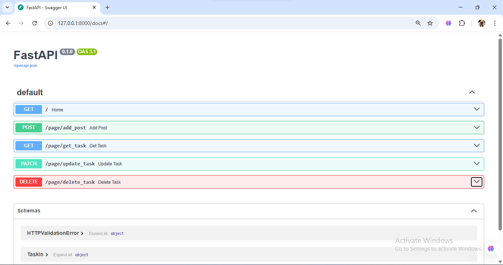
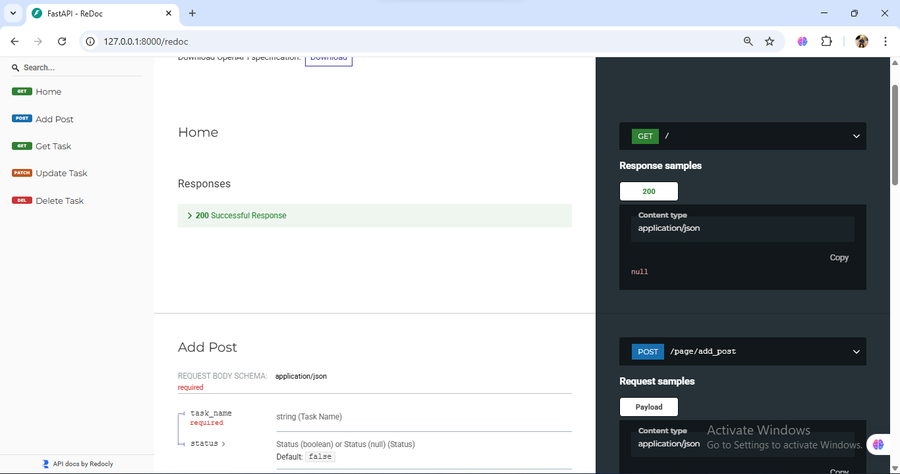

# To-Do List API

A simple **To-Do List REST API** built with **FastAPI** for learning and practice purposes.  
This API manages tasks using an **in-memory Python list** (no database) and supports full CRUD operations.

---

## 🚀 Features

- Create a new task
- Retrieve all tasks
- Update task status (done / not done)
- Delete a task
- Prevents duplicate tasks
- Ensures a task exists before updating or deleting
- Interactive API documentation with **Swagger UI** and **ReDoc**
- CORS enabled for cross-origin access

---

## 🛠️ Tech Stack

- Python
- FastAPI
- Uvicorn

---

## 📦 Data Storage

- Tasks are stored in a **Python list**
- The list is declared in the `utils` folder and imported into the task routes
- **No database is used**
- All data is lost when the server restarts

---

## 🌐 CORS Configuration

This API uses **CORS Middleware** to allow access from different origins.

CORS is configured to allow requests from:
- Swagger UI
- ReDoc
- Frontend applications
- External tools such as Postman

### Current CORS Settings

- **Allowed Origins:** All (`*`)
- **Allowed Methods:** All
- **Allowed Headers:** All
- **Credentials:** Allowed

> ⚠️ Note: Allowing all origins is suitable for development and learning.  
> For production environments, it is recommended to restrict allowed origins for security.

---

## 📌 API Endpoints

### ➕ Create Task
**POST** `/add_post`

- Creates a new task
- Duplicate tasks are **not allowed**
- If a task already exists, an error message is returned

---

### 📄 Get All Tasks
**GET** `/`

- Retrieves all tasks currently stored in memory

---

### ✏️ Update Task
**PATCH** `/update`

- Updates the status of a task
- Uses **query parameters**, not path parameters
- The task **must exist** before it can be updated
- Returns an error if the task is not found

**Example:**
/update?task_name={task_name}&status={task_status}

---

### 🗑️ Delete Task
**DELETE** `/delete`

- Deletes a task from the list
- Uses **query parameters**, not path parameters
- The task **must exist** before it can be deleted
- Returns an error if the task is not found

**Example:**
/delete?task_name={task_name}

---

## ▶️ How to Run the Project

### 1️⃣ Install Dependencies

Ensure Python is installed, then run:

```bash
pip install fastapi uvicorn
```

### 2️⃣ Start the Server
```bash
uvicorn main:app --reload
```

The API will be available at:
http://127.0.0.1:8000

### 3️⃣ API Documentation

Swagger UI:
http://127.0.0.1:8000/docs

ReDoc:
http://127.0.0.1:8000/redoc

## 📸 Screenshots




📘 Notes

This project is intended for practice and learning

No persistent storage is used

Demonstrates FastAPI routing, schemas, validation, and middleware usage

✅ Project Status

Completed and functional 🚀